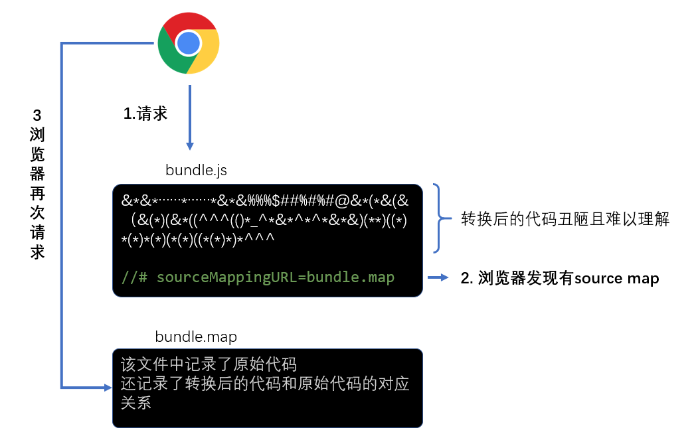
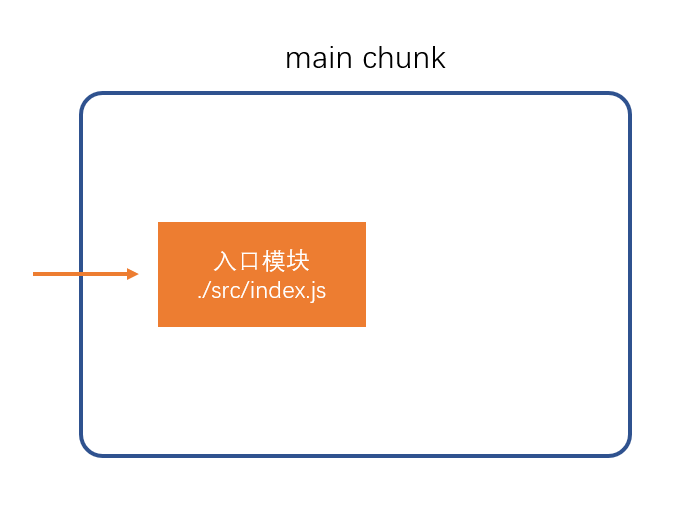
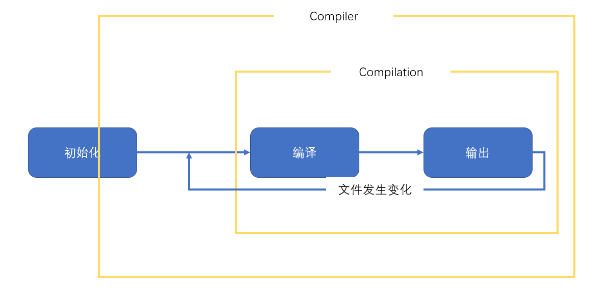
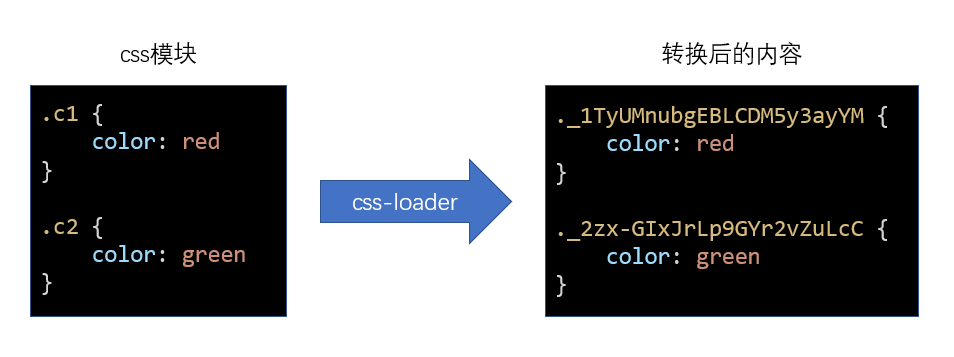
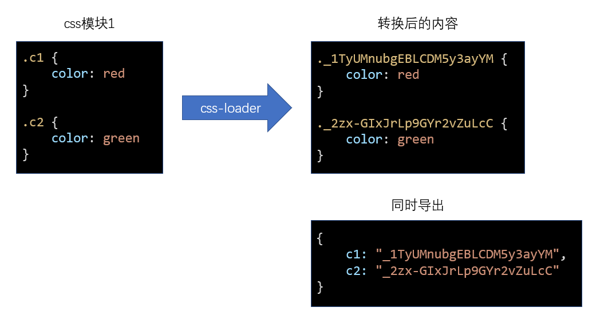
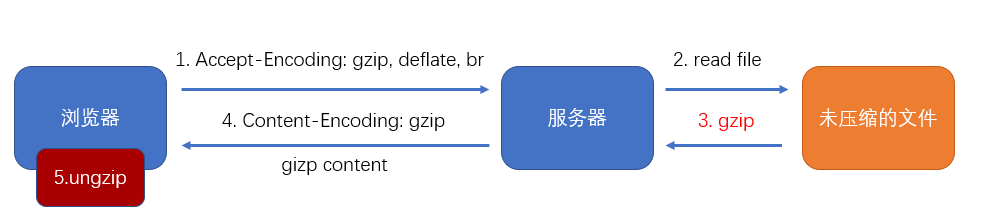

# 1 Webpack 核心功能

## 1-1 如何在浏览器端实现模块化 {ignore}

[toc]

### 课程简介

本门课需要的前置知识：ES6、模块化、包管理器、git

本门课的讲解特点：

1. 合适的深度：webpack 使用层面很简单，但原理层面非常复杂
2. 合适的广度：webpack 生态圈极其繁荣，有海量的第三方库可以融入到 webpack

### 浏览器端的模块化

问题：

- 效率问题：精细的模块划分带来了更多的 JS 文件，更多的 JS 文件带来了更多的请求，降低了页面访问效率
- 兼容性问题：浏览器目前仅支持 ES6 的模块化标准，并且还存在兼容性问题
- 工具问题：浏览器不支持 npm 下载的第三方包

这些仅仅是前端工程化的一个缩影

当开发一个具有规模的程序，你将遇到非常多的非业务问题，这些问题包括：执行效率、兼容性、代码的可维护性可扩展性、团队协作、测试等等等等，我们将这些问题称之为工程问题。工程问题与业务无关，但它深刻的影响到开发进度，如果没有一个好的工具解决这些问题，将使得开发进度变得极其缓慢，同时也让开发者陷入技术的泥潭。

### 根本原因

思考：上面提到的问题，为什么在 node 端没有那么明显，反而到了浏览器端变得如此严重呢？

答：在 node 端，运行的 JS 文件在本地，因此可以本地读取文件，它的效率比浏览器远程传输文件高的多

**根本原因**：在浏览器端，开发时态（devtime）和运行时态（runtime）的侧重点不一样

**开发时态，devtime：**

1. 模块划分越细越好
2. 支持多种模块化标准
3. 支持 npm 或其他包管理器下载的模块
4. 能够解决其他工程化的问题

**运行时态，runtime：**

1. 文件越少越好
2. 文件体积越小越好
3. 代码内容越乱越好
4. 所有浏览器都要兼容
5. 能够解决其他运行时的问题，主要是执行效率问题

这种差异在小项目中表现的并不明显，可是一旦项目形成规模，就越来越明显，如果不解决这些问题，前端项目形成规模只能是空谈

### 解决办法

既然开发时态和运行时态面临的局面有巨大的差异，因此，我们需要有一个工具，这个工具能够让开发者专心的在开发时态写代码，然后利用这个工具将开发时态编写的代码转换为运行时态需要的东西。

这样的工具，叫做**构建工具**


这样一来，开发者就可以专注于开发时态的代码结构，而不用担心运行时态遇到的问题了。

### 常见的构建工具

- **webpack**
- grunt
- gulp
- browserify
- fis
- 其他

---

## 1-2 webpack 的安装和使用 {ignore}

[toc]

> webpack 官网：https://www.webpackjs.com/
> 目前的最新版本：webpack4

### webpack 简介

webpack 是基于模块化的打包（构建）工具，它把一切视为模块

它通过一个开发时态的入口模块为起点，分析出所有的依赖关系，然后经过一系列的过程（压缩、合并），最终生成运行时态的文件。

webpack 的特点：

- **为前端工程化而生**：webpack 致力于解决前端工程化，特别是浏览器端工程化中遇到的问题，让开发者集中注意力编写业务代码，而把工程化过程中的问题全部交给 webpack 来处理
- **简单易用**：支持零配置，可以不用写任何一行额外的代码就使用 webpack
- **强大的生态**：webpack 是非常灵活、可以扩展的，webpack 本身的功能并不多，但它提供了一些可以扩展其功能的机制，使得一些第三方库可以融于到 webpack 中
- **基于 nodejs**：由于 webpack 在构建的过程中需要读取文件，因此它是运行在 node 环境中的
- **基于模块化**：webpack 在构建过程中要分析依赖关系，方式是通过模块化导入语句进行分析的，它支持各种模块化标准，包括但不限于 CommonJS、ES6 Module

### webpack 的安装

webpack 通过 npm 安装，它提供了两个包：

- webpack：核心包，包含了 webpack 构建过程中要用到的所有 api
- webpack-cli：提供一个简单的 cli 命令，它调用了 webpack 核心包的 api，来完成构建过程

安装方式：

- 全局安装：可以全局使用 webpack 命令，但是无法为不同项目对应不同的 webpack 版本
- **本地安装**：推荐，每个项目都使用自己的 webpack 版本进行构建

### 使用

```shell
webpack
```

默认情况下，webpack 会以`./src/index.js`作为入口文件分析依赖关系，打包到`./dist/main.js`文件中

通过--mode 选项可以控制 webpack 的打包结果的运行环境

---

## 1-3 模块化兼容性

由于 webpack 同时支持 CommonJS 和 ES6 module，因此需要理解它们互操作时 webpack 是如何处理的

### 同模块化标准

如果导出和导入使用的是同一种模块化标准，打包后的效果和之前学习的模块化没有任何差异


### 不同模块化标准

不同的模块化标准，webpack 按照如下的方式处理


### 最佳实践

代码编写最忌讳的是精神分裂，选择一个合适的模块化标准，然后贯彻整个开发阶段。

---

## 1-5 编译结果分析

```js
// ./src/index.js
console.log('index module');
var a = require('./a');
a.d();
console.log(a);
```

```js
// ./src/a.js
console.log('module a');
module.exports = 'a';
```

```js
// ./dist/mymain.js
(function (modules) {
  const cacheModule = {};
  function require(moduleId) {
    if (cacheModule[moduleId]) {
      return cacheModule[moduleId];
    }
    var module = {
      exports: {},
    };
    var func = modules[moduleId];
    func(module, module.exports, require);
    cacheModule[moduleId] = module.exports;
    return module.exports;
  }
  require('./src/index.js');
  require('./src/index.js');
  return require('./src/index.js');
})({
  './src/index.js': function (module, exports, require) {
    // console.log("index module");
    // var a = require("./src/a.js");
    // a.d();
    // console.log(a);
    eval(
      'console.log("index module");\nvar a = require("./src/a.js");\na.d();\nconsole.log(a); //# sourceURL=webpack:///./src/index.js'
    );
  },
  './src/a.js': function (module, exports) {
    console.log('module a');
    module.exports = 'a';
  },
});
```

---

## 1-6 配置文件

webpack 提供的 cli 支持很多的参数，例如`--mode`，但更多的时候，我们会使用更加灵活的配置文件来控制 webpack 的行为

默认情况下，webpack 会读取`webpack.config.js`文件作为配置文件，但也可以通过 CLI 参数`--config`来指定某个配置文件

配置文件中通过 CommonJS 模块导出一个对象，对象中的各种属性对应不同的 webpack 配置

**注意：配置文件中的代码，必须是有效的 node 代码**

当命令行参数与配置文件中的配置出现冲突时，以命令行参数为准。

**基本配置：**

1. mode：编译模式，字符串，取值为 development 或 production，指定编译结果代码运行的环境，会影响 webpack 对编译结果代码格式的处理
2. entry：入口，字符串（后续会详细讲解），指定入口文件
3. output：出口，对象（后续会详细讲解），指定编译结果文件

---

## 1-7 devtool 配置 {ignore}

[toc]

### source map 源码地图

> 本小节的知识与 webpack 无关

前端发展到现阶段，很多时候都不会直接运行源代码，可能需要对源代码进行合并、压缩、转换等操作，真正运行的是转换后的代码


这就给调试带来了困难，因为当运行发生错误的时候，我们更加希望能看到源代码中的错误，而不是转换后代码的错误

> jquery 压缩后的代码：https://code.jquery.com/jquery-3.4.1.min.js

为了解决这一问题，chrome 浏览器率先支持了 source map，其他浏览器纷纷效仿，目前，几乎所有新版浏览器都支持了 source map

source map 实际上是一个配置，配置中不仅记录了所有源码内容，还记录了和转换后的代码的对应关系

下面是浏览器处理 source map 的原理




**最佳实践**：

1. source map 应在开发环境中使用，作为一种调试手段
2. source map 不应该在生产环境中使用，source map 的文件一般较大，不仅会导致额外的网络传输，还容易暴露原始代码。即便要在生产环境中使用 source map，用于调试真实的代码运行问题，也要做出一些处理规避网络传输和代码暴露的问题。

### webpack 中的 source map

使用 webpack 编译后的代码难以调试，可以通过 devtool 配置来**优化调试体验**

具体的配置见文档：https://www.webpackjs.com/configuration/devtool/

---

## 1-8 webpack 编译过程 {ignore}

[toc]

webpack 的作用是将源代码编译（构建、打包）成最终代码


整个过程大致分为三个步骤

1. 初始化
2. 编译
3. 输出


### 初始化

此阶段，webpack 会将**CLI 参数**、**配置文件**、**默认配置**进行融合，形成一个最终的配置对象。

对配置的处理过程是依托一个第三方库`yargs`完成的

此阶段相对比较简单，主要是为接下来的编译阶段做必要的准备

目前，可以简单的理解为，初始化阶段主要用于产生一个最终的配置

### 编译

1. **创建 chunk**

chunk 是 webpack 在内部构建过程中的一个概念，译为`块`，它表示通过某个入口找到的所有依赖的统称。

根据入口模块（默认为`./src/index.js`）创建一个 chunk



每个 chunk 都有至少两个属性：

- name：默认为 main
- id：唯一编号，开发环境和 name 相同，生产环境是一个数字，从 0 开始

2. **构建所有依赖模块**


> AST 在线测试工具：https://astexplorer.net/

简图


3. **产生 chunk assets**

在第二步完成后，chunk 中会产生一个模块列表，列表中包含了**模块 id**和**模块转换后的代码**

接下来，webpack 会根据配置为 chunk 生成一个资源列表，即`chunk assets`，资源列表可以理解为是生成到最终文件的文件名和文件内容


> chunk hash 是根据所有 chunk assets 的内容生成的一个 hash 字符串
> hash：一种算法，具体有很多分类，特点是将一个任意长度的字符串转换为一个固定长度的字符串，而且可以保证原始内容不变，产生的 hash 字符串就不变

简图


4. **合并 chunk assets**

将多个 chunk 的 assets 合并到一起，并产生一个总的 hash


### 输出

此步骤非常简单，webpack 将利用 node 中的 fs 模块（文件处理模块），根据编译产生的总的 assets，生成相应的文件。


### 总过程


**涉及术语**

1. module：模块，分割的代码单元，webpack 中的模块可以是任何内容的文件，不仅限于 JS
2. chunk：webpack 内部构建模块的块，一个 chunk 中包含多个模块，这些模块是从入口模块通过依赖分析得来的
3. bundle：chunk 构建好模块后会生成 chunk 的资源清单，清单中的每一项就是一个 bundle，可以认为 bundle 就是最终生成的文件
4. hash：最终的资源清单所有内容联合生成的 hash 值
5. chunkhash：chunk 生成的资源清单内容联合生成的 hash 值
6. chunkname：chunk 的名称，如果没有配置则使用 main
7. id：通常指 chunk 的唯一编号，如果在开发环境下构建，和 chunkname 相同；如果是生产环境下构建，则使用一个从 0 开始的数字进行编号

---

## 1-9 入口和出口

```js
/*

./ : 
1. 模块化代码中，比如require("./")，表示当前js文件所在的目录
2. 在路径处理中，"./"表示node运行目录

__dirname: 所有情况下，都表示当前运行的js文件所在的目录，它是一个绝对路径

*/
```


> node 内置模块 - path: https://nodejs.org/dist/latest-v12.x/docs/api/path.html

**出口**

这里的出口是针对资源列表的文件名或路径的配置

出口通过 output 进行配置

**入口**

**入口真正配置的是 chunk**

入口通过 entry 进行配置

规则：

- name：chunkname
- hash: 总的资源 hash，通常用于解决缓存问题
- chunkhash: 使用 chunkhash
- id: 使用 chunkid，不推荐

---

## 1-10 入口和出口的最佳实践 {ignore}

具体情况具体分析

下面是一些经典场景

### 一个页面一个 JS


源码结构

```
|—— src
    |—— pageA   页面A的代码目录
        |—— index.js 页面A的启动模块
        |—— ...
    |—— pageB   页面B的代码目录
        |—— index.js 页面B的启动模块
        |—— ...
    |—— pageC   页面C的代码目录
        |—— main1.js 页面C的启动模块1 例如：主功能
        |—— main2.js 页面C的启动模块2 例如：实现访问统计的额外功能
        |—— ...
    |—— common  公共代码目录
        |—— ...
```

webpack 配置

```js
module.exports = {
  entry: {
    pageA: './src/pageA/index.js',
    pageB: './src/pageB/index.js',
    pageC: ['./src/pageC/main1.js', './src/pageC/main2.js'],
  },
  output: {
    filename: '[name].[chunkhash:5].js',
  },
};
```

这种方式适用于页面之间的功能差异巨大、公共代码较少的情况，这种情况下打包出来的最终代码不会有太多重复

### 一个页面多个 JS


源码结构

```
|—— src
    |—— pageA   页面A的代码目录
        |—— index.js 页面A的启动模块
        |—— ...
    |—— pageB   页面B的代码目录
        |—— index.js 页面B的启动模块
        |—— ...
    |—— statistics   用于统计访问人数功能目录
        |—— index.js 启动模块
        |—— ...
    |—— common  公共代码目录
        |—— ...
```

webpack 配置

```js
module.exports = {
  entry: {
    pageA: './src/pageA/index.js',
    pageB: './src/pageB/index.js',
    statistics: './src/statistics/index.js',
  },
  output: {
    filename: '[name].[chunkhash:5].js',
  },
};
```

这种方式适用于页面之间有一些**独立**、相同的功能，专门使用一个 chunk 抽离这部分 JS 有利于浏览器更好的缓存这部分内容。

> 思考：为什么不使用多启动模块的方式？

### 单页应用

所谓单页应用，是指整个网站（或网站的某一个功能块）只有一个页面，页面中的内容全部靠 JS 创建和控制。 vue 和 react 都是实现单页应用的利器。


源码结构

```
|—— src
    |—— subFunc   子功能目录
        |—— ...
    |—— subFunc   子功能目录
        |—— ...
    |—— common  公共代码目录
        |—— ...
    |—— index.js
```

webpack 配置

```js
module.exports = {
  entry: './src/index.js',
  output: {
    filename: 'index.[hash:5].js',
  },
};
```

---

## 1-11 loader

> webpack 做的事情，仅仅是分析出各种模块的依赖关系，然后形成资源列表，最终打包生成到指定的文件中。
> 更多的功能需要借助 webpack loaders 和 webpack plugins 完成。

webpack loader： loader 本质上是一个函数，它的作用是将某个源码字符串转换成另一个源码字符串返回。


loader 函数的将在模块解析的过程中被调用，以得到最终的源码。

**全流程：**


**chunk 中解析模块的流程：**


**chunk 中解析模块的更详细流程：**


**处理 loaders 流程：**


**loader 配置：**

**完整配置**

```js
module.exports = {
  module: {
    //针对模块的配置，目前版本只有两个配置，rules、noParse
    rules: [
      //模块匹配规则，可以存在多个规则
      {
        //每个规则是一个对象
        test: /\.js$/, //匹配的模块正则
        use: [
          //匹配到后应用的规则模块
          {
            //其中一个规则
            loader: '模块路径', //loader模块的路径，该字符串会被放置到require中
            options: {
              //向对应loader传递的额外参数
            },
          },
        ],
      },
    ],
  },
};
```

**简化配置**

```js
module.exports = {
  module: {
    //针对模块的配置，目前版本只有两个配置，rules、noParse
    rules: [
      //模块匹配规则，可以存在多个规则
      {
        //每个规则是一个对象
        test: /\.js$/, //匹配的模块正则
        use: ['模块路径1', '模块路径2'], //loader模块的路径，该字符串会被放置到require中
      },
    ],
  },
};
```

---

## 1-14 plugin

loader 的功能定位是转换代码，而一些其他的操作难以使用 loader 完成，比如：

- 当 webpack 生成文件时，顺便多生成一个说明描述文件
- 当 webpack 编译启动时，控制台输出一句话表示 webpack 启动了
- 当 xxxx 时，xxxx

这种类似的功能需要把功能嵌入到 webpack 的编译流程中，而这种事情的实现是依托于 plugin 的


plugin 的**本质**是一个带有 apply 方法的对象

```js
var plugin = {
  apply: function (compiler) {},
};
```

通常，习惯上，我们会将该对象写成构造函数的模式

```js
class MyPlugin {
  apply(compiler) {}
}

var plugin = new MyPlugin();
```

要将插件应用到 webpack，需要把插件对象配置到 webpack 的 plugins 数组中，如下：

```js
module.exports = {
  plugins: [new MyPlugin()],
};
```

apply 函数会在初始化阶段，创建好 Compiler 对象后运行。

compiler 对象是在初始化阶段构建的，整个 webpack 打包期间只有一个 compiler 对象，后续完成打包工作的是 compiler 对象内部创建的 compilation

apply 方法会在**创建好 compiler 对象后调用**，并向方法传入一个 compiler 对象



compiler 对象提供了大量的钩子函数（hooks，可以理解为事件），plugin 的开发者可以注册这些钩子函数，参与 webpack 编译和生成。

你可以在 apply 方法中使用下面的代码注册钩子函数:

```js
class MyPlugin {
  apply(compiler) {
    compiler.hooks.事件名称.事件类型(name, function (compilation) {
      //事件处理函数
    });
  }
}
```

**事件名称**

即要监听的事件名，即钩子名，所有的钩子：https://www.webpackjs.com/api/compiler-hooks

**事件类型**

这一部分使用的是 Tapable API，这个小型的库是一个专门用于钩子函数监听的库。

它提供了一些事件类型：

- tap：注册一个同步的钩子函数，函数运行完毕则表示事件处理结束
- tapAsync：注册一个基于回调的异步的钩子函数，函数通过调用一个回调表示事件处理结束
- tapPromise：注册一个基于 Promise 的异步的钩子函数，函数通过返回的 Promise 进入已决状态表示事件处理结束

**处理函数**

处理函数有一个事件参数`compilation`

---

## 1-16 区分环境 {ignore}

[toc]

有些时候，我们需要针对生产环境和开发环境分别书写 webpack 配置

为了更好的适应这种要求，webpack 允许配置不仅可以是一个对象，还可以是一个**函数**

```js
module.exports = (env) => {
  return {
    //配置内容
  };
};
```

在开始构建时，webpack 如果发现配置是一个函数，会调用该函数，将函数返回的对象作为配置内容，因此，开发者可以根据不同的环境返回不同的对象

在调用 webpack 函数时，webpack 会向函数传入一个参数 env，该参数的值来自于 webpack 命令中给 env 指定的值，例如

```shell
npx webpack --env abc # env: "abc"

npx webpack --env.abc # env: {abc:true}
npx webpack --env.abc=1  # env： {abc:1}
npx webpack --env.abc=1 --env.bcd=2 # env: {abc:1, bcd:2}
```

这样一来，我们就可以在命令中指定环境，在代码中进行判断，根据环境返回不同的配置结果。

---

## 1-17 其他细节配置 {ignore}

[toc]

### context

```js
context: path.resolve(__dirname, 'app');
```

该配置会影响入口和 loaders 的解析，入口和 loaders 的相对路径会以 context 的配置作为基准路径，这样，你的配置会独立于 CWD（current working directory 当前执行路径）

### output

### library

```js
library: 'abc';
```

这样一来，打包后的结果中，会将自执行函数的执行结果暴露给 abc

### libraryTarget

```js
libraryTarget: 'var';
```

该配置可以更加精细的控制如何暴露入口包的导出结果

其他可用的值有：

- var：默认值，暴露给一个普通变量
- window：暴露给 window 对象的一个属性
- this：暴露给 this 的一个属性
- global：暴露给 global 的一个属性
- commonjs：暴露给 exports 的一个属性
- 其他：https://www.webpackjs.com/configuration/output/#output-librarytarget

### target

```js
target: 'web'; //默认值
```

设置打包结果最终要运行的环境，常用值有

- web: 打包后的代码运行在 web 环境中
- node：打包后的代码运行在 node 环境中
- 其他：https://www.webpackjs.com/configuration/target/

### module.noParse

```js
noParse: /jquery/;
```

不解析正则表达式匹配的模块，通常用它来忽略那些大型的单模块库，以提高**构建性能**

### resolve

resolve 的相关配置主要用于控制模块解析过程

### modules

```js
modules: ['node_modules']; //默认值
```

当解析模块时，如果遇到导入语句，`require("test")`，webpack 会从下面的位置寻找依赖的模块

1. 当前目录下的`node_modules`目录
2. 上级目录下的`node_modules`目录
3. ...

### extensions

```js
extensions: ['.js', '.json']; //默认值
```

当解析模块时，遇到无具体后缀的导入语句，例如`require("test")`，会依次测试它的后缀名

- test.js
- test.json

### alias

```js
alias: {
  "@": path.resolve(__dirname, 'src'),
  "_": __dirname
}
```

有了 alias（别名）后，导入语句中可以加入配置的键名，例如`require("@/abc.js")`，webpack 会将其看作是`require(src的绝对路径+"/abc.js")`。

在大型系统中，源码结构往往比较深和复杂，别名配置可以让我们更加方便的导入依赖

### externals

```js
externals: {
    jquery: "$",
    lodash: "_"
}
```

从最终的 bundle 中排除掉配置的配置的源码，例如，入口模块是

```js
//index.js
require('jquery');
require('lodash');
```

生成的 bundle 是：

```js
(function(){
    ...
})({
    "./src/index.js": function(module, exports, __webpack_require__){
        __webpack_require__("jquery")
        __webpack_require__("lodash")
    },
    "jquery": function(module, exports){
        //jquery的大量源码
    },
    "lodash": function(module, exports){
        //lodash的大量源码
    },
})
```

但有了上面的配置后，则变成了

```js
(function(){
    ...
})({
    "./src/index.js": function(module, exports, __webpack_require__){
        __webpack_require__("jquery")
        __webpack_require__("lodash")
    },
    "jquery": function(module, exports){
        module.exports = $;
    },
    "lodash": function(module, exports){
        module.exports = _;
    },
})
```

这比较适用于一些第三方库来自于外部 CDN 的情况，这样一来，即可以在页面中使用 CDN，又让 bundle 的体积变得更小，还不影响源码的编写

### stats

stats 控制的是构建过程中控制台的输出内容

---

# 2 常用扩展

## 2-1 clean-webpack-plugin

---

## 2-2 html-webpack-plugin

---

## 2-3 copy-webpack-plugin

---

## 2-4 开发服务器

在**开发阶段**，目前遇到的问题是打包、运行、调试过程过于繁琐，回顾一下我们的操作流程：

1. 编写代码
2. 控制台运行命令完成打包
3. 打开页面查看效果
4. 继续编写代码，回到步骤 2

并且，我们往往希望把最终生成的代码和页面部署到服务器上，来模拟真实环境

为了解决这些问题，webpack 官方制作了一个单独的库：**webpack-dev-server**

它**既不是 plugin 也不是 loader**

先来看看它怎么用

1. 安装
2. 执行`webpack-dev-server`命令

`webpack-dev-server`命令几乎支持所有的 webpack 命令参数，如`--config`、`-env`等等，你可以把它当作 webpack 命令使用

这个命令是专门为开发阶段服务的，真正部署的时候还是得使用 webpack 命令

当我们执行`webpack-dev-server`命令后，它做了以下操作：

1. 内部执行 webpack 命令，传递命令参数
2. 开启 watch
3. 注册 hooks：类似于 plugin，webpack-dev-server 会向 webpack 中注册一些钩子函数，主要功能如下：
   1. 将资源列表（aseets）保存起来
   2. 禁止 webpack 输出文件
4. 用 express 开启一个服务器，监听某个端口，当请求到达后，根据请求的路径，给予相应的资源内容

**配置**

针对 webpack-dev-server 的配置，参考：https://www.webpackjs.com/configuration/dev-server/

常见配置有：

- port：配置监听端口
- proxy：配置代理，常用于跨域访问
- stats：配置控制台输出内容

---

## 2-5 普通文件处理

file-loader: 生成依赖的文件到输出目录，然后将模块文件设置为：导出一个路径\

```js
//file-loader
function loader(source) {
  // source：文件内容（图片内容 buffer）
  // 1. 生成一个具有相同文件内容的文件到输出目录
  // 2. 返回一段代码   export default "文件名"
}
```

url-loader：将依赖的文件转换为：导出一个 base64 格式的字符串

```js
//file-loader
function loader(source) {
  // source：文件内容（图片内容 buffer）
  // 1. 根据buffer生成一个base64编码
  // 2. 返回一段代码   export default "base64编码"
}
```

---

## 2-6 解决路径问题

在使用 file-loader 或 url-loader 时，可能会遇到一个非常有趣的问题

比如，通过 webpack 打包的目录结构如下：

```yaml
dist
    |—— img
        |—— a.png  #file-loader生成的文件
    |—— scripts
        |—— main.js  #export default "img/a.png"
    |—— html
        |—— index.html #<script src="../scripts/main.js" ></script>
```

这种问题发生的根本原因：模块中的路径来自于某个 loader 或 plugin，当产生路径时，loader 或 plugin 只有相对于 dist 目录的路径，并不知道该路径将在哪个资源中使用，从而无法确定最终正确的路径

面对这种情况，需要依靠 webpack 的配置 publicPath 解决

---

## 2-7 webpack 内置插件 {ignore}

所有的 webpack 内置插件都作为 webpack 的静态属性存在的，使用下面的方式即可创建一个插件对象

```js
const webpack = require('webpack');

new webpack.插件名(options);
```

### DefinePlugin

全局常量定义插件，使用该插件通常定义一些常量值，例如：

```js
new webpack.DefinePlugin({
  PI: `Math.PI`, // PI = Math.PI
  VERSION: `"1.0.0"`, // VERSION = "1.0.0"
  DOMAIN: JSON.stringify('duyi.com'),
});
```

这样一来，在源码中，我们可以直接使用插件中提供的常量，当 webpack 编译完成后，会自动替换为常量的值

### BannerPlugin

它可以为每个 chunk 生成的文件头部添加一行注释，一般用于添加作者、公司、版权等信息

```js
new webpack.BannerPlugin({
  banner: `
  hash:[hash]
  chunkhash:[chunkhash]
  name:[name]
  author:yuanjin
  corporation:duyi
  `,
});
```

### ProvidePlugin

自动加载模块，而不必到处 import 或 require

```js
new webpack.ProvidePlugin({
  $: 'jquery',
  _: 'lodash',
});
```

然后在我们任意源码中：

```js
$('#item'); // <= 起作用
_.drop([1, 2, 3], 2); // <= 起作用
```

---

# 3 css 工程化

## 3-1 css 工程化概述 {ignore}

### css 的问题

### 类名冲突的问题

当你写一个 css 类的时候，你是写全局的类呢，还是写多个层级选择后的类呢？

你会发现，怎么都不好

- 过深的层级不利于编写、阅读、压缩、复用
- 过浅的层级容易导致类名冲突

一旦样式多起来，这个问题就会变得越发严重，其实归根结底，就是类名冲突不好解决的问题

### 重复样式

这种问题就更普遍了，一些重复的样式值总是不断的出现在 css 代码中，维护起来极其困难

比如，一个网站的颜色一般就那么几种：

- primary
- info
- warn
- error
- success

如果有更多的颜色，都是从这些色调中自然变化得来，可以想象，这些颜色会到处充斥到诸如背景、文字、边框中，一旦要做颜色调整，是一个非常大的工程

### css 文件细分问题

在大型项目中，css 也需要更细的拆分，这样有利于 css 代码的维护。

比如，有一个做轮播图的模块，它不仅需要依赖 js 功能，还需要依赖 css 样式，既然依赖的 js 功能仅关心轮播图，那 css 样式也应该仅关心轮播图，由此类推，不同的功能依赖不同的 css 样式、公共样式可以单独抽离，这样就形成了不同于过去的 css 文件结构：文件更多、拆分的更细

而同时，在真实的运行环境下，我们却希望文件越少越好，这种情况和 JS 遇到的情况是一致的

因此，对于 css，也需要工程化管理

从另一个角度来说，css 的工程化会遇到更多的挑战，因为 css 不像 JS，它的语法本身经过这么多年并没有发生多少的变化（css3 也仅仅是多了一些属性而已），对于 css 语法本身的改变也是一个工程化的课题

### 如何解决

这么多年来，官方一直没有提出方案来解决上述问题

一些第三方机构针对不同的问题，提出了自己的解决方案

### 解决类名冲突

一些第三方机构提出了一些方案来解决该问题，常见的解决方案如下：

**命名约定**

即提供一种命名的标准，来解决冲突，常见的标准有：

- BEM
- OOCSS
- AMCSS
- SMACSS
- 其他

**css in js**

这种方案非常大胆，它觉得，css 语言本身几乎无可救药了，干脆直接用 js 对象来表示样式，然后把样式直接应用到元素的 style 中

这样一来，css 变成了一个一个的对象，就可以完全利用到 js 语言的优势，你可以：

- 通过一个函数返回一个样式对象
- 把公共的样式提取到公共模块中返回
- 应用 js 的各种特性操作对象，比如：混合、提取、拆分
- 更多的花样

> 这种方案在手机端的 React Native 中大行其道

**css module**

非常有趣和好用的 css 模块化方案，编写简单，绝对不重名

具体的课程中详细介绍

### 解决重复样式的问题

**css in js**

这种方案虽然可以利用 js 语言解决重复样式值的问题，但由于太过激进，很多习惯写 css 的开发者编写起来并不是很适应

**预编译器**

有些第三方搞出一套 css 语言的进化版来解决这个问题，它支持变量、函数等高级语法，然后经过编译器将其编译成为正常的 css

这种方案特别像构建工具，不过它仅针对 css

常见的预编译器支持的语言有：

- less
- sass

### 解决 css 文件细分问题

这一部分，就要依靠构建工具，例如 webpack 来解决了

利用一些 loader 或 plugin 来打包、合并、压缩 css 文件

---

## 3-2 利用 webpack 拆分 css {ignore}

要拆分 css，就必须把 css 当成像 js 那样的模块；要把 css 当成模块，就必须有一个构建工具（webpack），它具备合并代码的能力

而 webpack 本身只能读取 css 文件的内容、将其当作 JS 代码进行分析，因此，会导致错误

于是，就必须有一个 loader，能够将 css 代码转换为 js 代码

### css-loader

css-loader 的作用，就是将 css 代码转换为 js 代码

它的处理原理极其简单：将 css 代码作为字符串导出

例如：

```css
.red {
  color: '#f40';
}
```

经过 css-loader 转换后变成 js 代码：

```js
module.exports = `.red{
    color:"#f40";
}`;
```

> 上面的 js 代码是经过我简化后的，不代表真实的 css-loader 的转换后代码，css-loader 转换后的代码会有些复杂，同时会导出更多的信息，但核心思想不变

再例如：

```css
.red {
  color: '#f40';
  background: url('./bg.png');
}
```

经过 css-loader 转换后变成 js 代码：

```js
var import1 = require('./bg.png');
module.exports = `.red{
    color:"#f40";
    background:url("${import1}")
}`;
```

这样一来，经过 webpack 的后续处理，会把依赖`./bg.png`添加到模块列表，然后再将代码转换为

```js
var import1 = __webpack_require__('./src/bg.png');
module.exports = `.red{
    color:"#f40";
    background:url("${import1}")
}`;
```

再例如：

```css
@import './reset.css';
.red {
  color: '#f40';
  background: url('./bg.png');
}
```

会转换为：

```js
var import1 = require('./reset.css');
var import2 = require('./bg.png');
module.exports = `${import1}
.red{
    color:"#f40";
    background:url("${import2}")
}`;
```

总结，css-loader 干了什么：

1. 将 css 文件的内容作为字符串导出
2. 将 css 中的其他依赖作为 require 导入，以便 webpack 分析依赖

### style-loader

由于 css-loader 仅提供了将 css 转换为字符串导出的能力，剩余的事情要交给其他 loader 或 plugin 来处理

style-loader 可以将 css-loader 转换后的代码进一步处理，将 css-loader 导出的字符串加入到页面的 style 元素中

例如：

```css
.red {
  color: '#f40';
}
```

经过 css-loader 转换后变成 js 代码：

```js
module.exports = `.red{
    color:"#f40";
}`;
```

经过 style-loader 转换后变成：

```js
module.exports = `.red{
    color:"#f40";
}`;
var style = module.exports;
var styleElem = document.createElement('style');
styleElem.innerHTML = style;
document.head.appendChild(styleElem);
module.exports = {};
```

> 以上代码均为简化后的代码，并不代表真实的代码
> style-loader 有能力避免同一个样式的重复导入

---

## 3-3 BEM

BEM 是一套针对 css 类样式的命名方法。

> 其他命名方法还有：OOCSS、AMCSS、SMACSS 等等

BEM 全称是：**B**lock **E**lement **M**odifier

一个完整的 BEM 类名：block**element_modifier，例如：```banner**dot_selected```，可以表示：轮播图中，处于选中状态的小圆点


三个部分的具体含义为：

- **Block**：页面中的大区域，表示最顶级的划分，例如：轮播图(`banner`)、布局(`layout`)、文章(`article`)等等
- **element**：区域中的组成部分，例如：轮播图中的横幅图片(`banner__img`)、轮播图中的容器（`banner__container`）、布局中的头部(`layout__header`)、文章中的标题(`article_title`)
- **modifier**：可选。通常表示状态，例如：处于展开状态的布局左边栏（`layout__left_expand`）、处于选中状态的轮播图小圆点(`banner__dot_selected`)

在某些大型工程中，如果使用 BEM 命名法，还可能会增加一个前缀，来表示类名的用途，常见的前缀有：

- **l**: layout，表示这个样式是用于布局的
- **c**: component，表示这个样式是一个组件，即一个功能区域
- **u**: util，表示这个样式是一个通用的、工具性质的样式
- **j**: javascript，表示这个样式没有实际意义，是专门提供给 js 获取元素使用的

---

## 3-4 css in js

css in js 的核心思想是：用一个 JS 对象来描述样式，而不是 css 样式表

例如下面的对象就是一个用于描述样式的对象：

```js
const styles = {
  backgroundColor: '#f40',
  color: '#fff',
  width: '400px',
  height: '500px',
  margin: '0 auto',
};
```

由于这种描述样式的方式**根本就不存在类名**，自然不会有类名冲突

至于如何把样式应用到界面上，不是它所关心的事情，你可以用任何技术、任何框架、任何方式将它应用到界面。

> 后续学习的 vue、react 都支持 css in js，可以非常轻松的应用到界面

css in js 的特点：

- **绝无冲突的可能**：由于它根本不存在类名，所以绝不可能出现类名冲突
- **更加灵活**：可以充分利用 JS 语言灵活的特点，用各种招式来处理样式
- **应用面更广**：只要支持 js 语言，就可以支持 css in js，因此，在一些用 JS 语言开发移动端应用的时候非常好用，因为移动端应用很有可能并不支持 css
- **书写不便**：书写样式，特别是公共样式的时候，处理起来不是很方便
- **在页面中增加了大量冗余内容**：在页面中处理 css in js 时，往往是将样式加入到元素的 style 属性中，会大量增加元素的内联样式，并且可能会有大量重复，不易阅读最终的页面代码

---

## 3-5 css module {ignore}

> 通过命名规范来限制类名太过死板，而 css in js 虽然足够灵活，但是书写不便。
> css module 开辟一种全新的思路来解决类名冲突的问题

### 思路

css module 遵循以下思路解决类名冲突问题：

1. css 的类名冲突往往发生在大型项目中
2. 大型项目往往会使用构建工具（webpack 等）搭建工程
3. 构建工具允许将 css 样式切分为更加精细的模块
4. 同 JS 的变量一样，每个 css 模块文件中难以出现冲突的类名，冲突的类名往往发生在不同的 css 模块文件中
5. 只需要保证构建工具在合并样式代码后不会出现类名冲突即可


### 实现原理

在 webpack 中，作为处理 css 的 css-loader，它实现了 css module 的思想，要启用 css module，需要将 css-loader 的配置`modules`设置为`true`。

css-loader 的实现方式如下：



原理极其简单，开启了 css module 后，css-loader 会将样式中的类名进行转换，转换为一个唯一的 hash 值。

由于 hash 值是根据模块路径和类名生成的，因此，不同的 css 模块，哪怕具有相同的类名，转换后的 hash 值也不一样。


### 如何应用样式

css module 带来了一个新的问题：源代码的类名和最终生成的类名是不一样的，而开发者只知道自己写的源代码中的类名，并不知道最终的类名是什么，那如何应用类名到元素上呢？

为了解决这个问题，css-loader 会导出原类名和最终类名的对应关系，该关系是通过一个对象描述的



这样一来，我们就可以在 js 代码中获取到 css 模块导出的结果，从而应用类名了

style-loader 为了我们更加方便的应用类名，会去除掉其他信息，仅暴露对应关系

### 其他操作

### 全局类名

某些类名是全局的、静态的，不需要进行转换，仅需要在类名位置使用一个特殊的语法即可：

```css
:global(.main) {
  ...;
}
```

使用了 global 的类名不会进行转换，相反的，没有使用 global 的类名，表示默认使用了 local

```css
:local(.main) {
  ...;
}
```

使用了 local 的类名表示局部类名，是可能会造成冲突的类名，会被 css module 进行转换

### 如何控制最终的类名

绝大部分情况下，我们都不需要控制最终的类名，因为控制它没有任何意义

如果一定要控制最终的类名，需要配置 css-loader 的`localIdentName`

### 其他注意事项

- css module 往往配合构建工具使用
- css module 尽量不要书写嵌套的类名，也没有这个必要
- css module 仅处理类名，不处理其他选择器
- css module 还会处理 id 选择器，不过任何时候都没有使用 id 选择器的理由
- 使用了 css module 后，只要能做到让类名望文知意即可，不需要遵守其他任何的命名规范

---

## 3-6 CSS 预编译器 {ignore}

### 基本原理

编写 css 时，受限于 css 语言本身，常常难以处理一些问题：

- 重复的样式值：例如常用颜色、常用尺寸
- 重复的代码段：例如绝对定位居中、清除浮动
- 重复的嵌套书写

由于官方迟迟不对 css 语言本身做出改进，一些第三方机构开始想办法来解决这些问题

其中一种方案，便是预编译器

预编译器的原理很简单，即使用一种更加优雅的方式来书写样式代码，通过一个编译器，将其转换为可被浏览器识别的传统 css 代码


目前，最流行的预编译器有**LESS**和**SASS**，由于它们两者特别相似，因此仅学习一种即可（本课程学习 LESS）


> less 官网：http://lesscss.org/
> less 中文文档 1（非官方）：http://lesscss.cn/
> less 中文文档 2（非官方）：https://less.bootcss.com/
> sass 官网：https://sass-lang.com/
> sass 中文文档 1（非官方）：https://www.sass.hk/
> sass 中文文档 2（非官方）：https://sass.bootcss.com/

### LESS 的安装和使用

从原理可知，要使用 LESS，必须要安装 LESS 编译器

LESS 编译器是基于 node 开发的，可以通过 npm 下载安装

```shell
npm i -D less
```

安装好了 less 之后，它提供了一个 CLI 工具`lessc`，通过该工具即可完成编译

```shell
lessc less代码文件 编译后的文件
```

试一试:

新建一个`index.less`文件，编写内容如下：

```less
// less代码
@red: #f40;

.redcolor {
  color: @red;
}
```

运行命令：

```shell
lessc index.less index.css
```

可以看到编译之后的代码：

```css
.redcolor {
  color: #f40;
}
```

### LESS 的基本使用

具体的使用见文档：https://less.bootcss.com/

- 变量
- 混合
- 嵌套
- 运算
- 函数
- 作用域
- 注释
- 导入

## 3-7 在 webpack 中使用 less

```json
 {
  test: /\.less$/,
  use: ["style-loader", "css-loader?modules", "less-loader"]
},
```

## 3-8 PostCss {ignore}

> 本节课的内容和 webpack 无关！！！

### 什么是 PostCss

学习到现在，可以看出，CSS 工程化面临着诸多问题，而解决这些问题的方案多种多样。

如果把 CSS 单独拎出来看，光是样式本身，就有很多事情要处理。

既然有这么多事情要处理，何不把这些事情集中到一起统一处理呢？

PostCss 就是基于这样的理念出现的。

PostCss 类似于一个编译器，可以将样式源码编译成最终的 CSS 代码


看上去是不是和 LESS、SASS 一样呢？

但 PostCss 和 LESS、SASS 的思路不同，它其实只做一些代码分析之类的事情，将分析的结果交给插件，具体的代码转换操作是插件去完成的。


官方的一张图更能说明 postcss 的处理流程：


> 这一点有点像 webpack，webpack 本身仅做依赖分析、抽象语法树分析，其他的操作是靠插件和加载器完成的。

官网地址：https://postcss.org/
github 地址：https://github.com/postcss/postcss

### 安装

PostCss 是基于 node 编写的，因此可以使用 npm 安装

```shell
npm i -D postcss
```

postcss 库提供了对应的 js api 用于转换代码，如果你想使用 postcss 的一些高级功能，或者想开发 postcss 插件，就要 api 使用 postcss，api 的文档地址是：http://api.postcss.org/

不过绝大部分时候，我们都是使用者，并不希望使用代码的方式来使用 PostCss

因此，我们可以再安装一个 postcss-cli，通过命令行来完成编译

```shell
npm i -D postcss-cli
```

postcss-cli 提供一个命令，它调用 postcss 中的 api 来完成编译

命令的使用方式为：

```shell
postcss 源码文件 -o 输出文件
```

### 配置文件

和 webpack 类似，postcss 有自己的配置文件，该配置文件会影响 postcss 的某些编译行为。

配置文件的默认名称是：`postcss.config.js`

例如：

```js
module.exports = {
  map: false, //关闭source-map
};
```

### 插件

光使用 postcss 是没有多少意义的，要让它真正的发挥作用，需要插件

postcss 的插件市场：https://www.postcss.parts/

下面罗列一些 postcss 的常用插件

### postcss-preset-env

过去使用 postcss 的时候，往往会使用大量的插件，它们各自解决一些问题

这样导致的结果是安装插件、配置插件都特别的繁琐

于是出现了这么一个插件`postcss-preset-env`，它称之为`postcss预设环境`，大意就是它整合了很多的常用插件到一起，并帮你完成了基本的配置，你只需要安装它一个插件，就相当于安装了很多插件了。

安装好该插件后，在 postcss 配置中加入下面的配置

```js
module.exports = {
  plugins: {
    'postcss-preset-env': {}, // {} 中可以填写插件的配置
  },
};
```

该插件的功能很多，下面一一介绍

### 自动的厂商前缀

某些新的 css 样式需要在旧版本浏览器中使用厂商前缀方可实现

例如

```css
::placeholder {
  color: red;
}
```

该功能在不同的旧版本浏览器中需要书写为

```css
::-webkit-input-placeholder {
  color: red;
}
::-moz-placeholder {
  color: red;
}
:-ms-input-placeholder {
  color: red;
}
::-ms-input-placeholder {
  color: red;
}
::placeholder {
  color: red;
}
```

要完成这件事情，需要使用`autoprefixer`库。

而`postcss-preset-env`内部包含了该库，自动有了该功能。

如果需要调整**兼容的浏览器**范围，可以通过下面的方式进行配置

**方式 1：在 postcss-preset-env 的配置中加入 browsers**

```js
module.exports = {
  plugins: {
    'postcss-preset-env': {
      browsers: ['last 2 version', '> 1%'],
    },
  },
};
```

**方式 2【推荐】：添加 .browserslistrc 文件**

创建文件`.browserslistrc`，填写配置内容

```
last 2 version
> 1%
```

**方式 3【推荐】：在 package.json 的配置中加入 browserslist**

```json
"browserslist": [
    "last 2 version",
    "> 1%"
]
```

`browserslist`是一个多行的（数组形式的）标准字符串。

它的书写规范多而繁琐，详情见：https://github.com/browserslist/browserslist

一般情况下，大部分网站都使用下面的格式进行书写

```
last 2 version
> 1% in CN
not ie <= 8
```

- `last 2 version`: 浏览器的兼容最近期的两个版本
- `> 1% in CN`: 匹配中国大于 1%的人使用的浏览器， `in CN`可省略
- `not ie <= 8`: 排除掉版本号小于等于 8 的 IE 浏览器

> 默认情况下，匹配的结果求的是并集

你可以通过网站：https://browserl.ist/ 对配置结果覆盖的浏览器进行查询，查询时，多行之间使用英文逗号分割

> browserlist 的数据来自于[CanIUse](http://caniuse.com/)网站，由于数据并非实时的，所以不会特别准确

### 未来的 CSS 语法

CSS 的某些前沿语法正在制定过程中，没有形成真正的标准，如果希望使用这部分语法，为了浏览器兼容性，需要进行编译

过去，完成该语法编译的是`cssnext`库，不过有了`postcss-preset-env`后，它自动包含了该功能。

你可以通过`postcss-preset-env`的`stage`配置，告知`postcss-preset-env`需要对哪个阶段的 css 语法进行兼容处理，它的默认值为 2

```js
"postcss-preset-env": {
    stage: 0
}
```

一共有 5 个阶段可配置：

- Stage 0: Aspirational - 只是一个早期草案，极其不稳定
- Stage 1: Experimental - 仍然极其不稳定，但是提议已被 W3C 公认
- Stage 2: Allowable - 虽然还是不稳定，但已经可以使用了
- Stage 3: Embraced - 比较稳定，可能将来会发生一些小的变化，它即将成为最终的标准
- Stage 4: Standardized - 所有主流浏览器都应该支持的 W3C 标准

了解了以上知识后，接下来了解一下未来的 css 语法，尽管某些语法仍处于非常早期的阶段，但是有该插件存在，编译后仍然可以被浏览器识别

#### 变量

未来的 css 语法是天然支持变量的

在`:root{}`中定义常用变量，使用`--`前缀命名变量

```css
:root {
  --lightColor: #ddd;
  --darkColor: #333;
}

a {
  color: var(--lightColor);
  background: var(--darkColor);
}
```

> 编译后，仍然可以看到原语法，因为某些新语法的存在并不会影响浏览器的渲染，尽管浏览器可能不认识
> 如果不希望在结果中看到新语法，可以配置`postcss-preset-env`的`preserve`为`false`

#### 自定义选择器

```css
@custom-selector :--heading h1, h2, h3, h4, h5, h6;
@custom-selector :--enter :focus, :hover;

a:--enter {
  color: #f40;
}

:--heading {
  font-weight: bold;
}

:--heading.active {
  font-weight: bold;
}
```

编译后

```css
a:focus,
a:hover {
  color: #f40;
}

h1,
h2,
h3,
h4,
h5,
h6 {
  font-weight: bold;
}

h1.active,
h2.active,
h3.active,
h4.active,
h5.active,
h6.active {
  font-weight: bold;
}
```

#### 嵌套

与 LESS 相同，只不过嵌套的选择器前必须使用符号`&`

```less
.a {
  color: red;
  & .b {
    color: green;
  }

  & > .b {
    color: blue;
  }

  &:hover {
    color: #000;
  }
}
```

编译后

```css
.a {
  color: red;
}

.a .b {
  color: green;
}

.a > .b {
  color: blue;
}

.a:hover {
  color: #000;
}
```

### postcss-apply

该插件可以支持在 css 中书写属性集

类似于 LESS 中的混入，可以利用 CSS 的新语法定义一个 CSS 代码片段，然后在需要的时候应用它

```less
:root {
  --center: {
    position: absolute;
    left: 50%;
    top: 50%;
    transform: translate(-50%, -50%);
  }
}

.item {
  @apply --center;
}
```

编译后

```css
.item {
  position: absolute;
  left: 50%;
  top: 50%;
  -webkit-transform: translate(-50%, -50%);
  transform: translate(-50%, -50%);
}
```

> 实际上，该功能也属于 cssnext，不知为何`postcss-preset-env`没有支持

### postcss-color-function

该插件支持在源码中使用一些颜色函数

```less
body {
  /* 使用颜色#aabbcc，不做任何处理，等同于直接书写 #aabbcc */
  color: color(#aabbcc);
  /* 将颜色#aabbcc透明度设置为90% */
  color: color(#aabbcc a(90%));
  /* 将颜色#aabbcc的红色部分设置为90% */
  color: color(#aabbcc red(90%));
  /* 将颜色#aabbcc调亮50%（更加趋近于白色），类似于less中的lighten函数 */
  color: color(#aabbcc tint(50%));
  /* 将颜色#aabbcc调暗50%（更加趋近于黑色），类似于less中的darken函数 */
  color: color(#aabbcc shade(50%));
}
```

编译后

```css
body {
  /* 使用颜色#aabbcc，不做任何处理，等同于直接书写 #aabbcc */
  color: rgb(170, 187, 204);
  /* 将颜色#aabbcc透明度设置为90% */
  color: rgba(170, 187, 204, 0.9);
  /* 将颜色#aabbcc的红色部分设置为90% */
  color: rgb(230, 187, 204);
  /* 将颜色#aabbcc调亮50%（更加趋近于白色），类似于less中的lighten函数 */
  color: rgb(213, 221, 230);
  /* 将颜色#aabbcc调暗50%（更加趋近于黑色），类似于less中的darken函数 */
  color: rgb(85, 94, 102);
}
```

### [扩展]postcss-import

该插件可以让你在`postcss`文件中导入其他样式代码，通过该插件可以将它们合并

> 由于后续的课程中，会将 postcss 加入到 webpack 中，而 webpack 本身具有依赖分析的功能，所以该插件的实际意义不大

### stylelint

> 官网：https://stylelint.io/

在实际的开发中，我们可能会错误的或不规范的书写一些 css 代码，stylelint 插件会即时的发现错误

由于不同的公司可能使用不同的 CSS 书写规范，stylelint 为了保持灵活，它本身并没有提供具体的规则验证

你需要安装或自行编写规则验证方案

通常，我们会安装`stylelint-config-standard`库来提供标准的 CSS 规则判定

安装好后，我们需要告诉 stylelint 使用该库来进行规则验证

告知的方式有多种，比较常见的是使用文件`.stylelintrc`

```json
//.styleintrc
{
  "extends": "stylelint-config-standard"
}
```

此时，如果你的代码出现不规范的地方，编译时将会报出错误

```css
body {
  background: #f4;
}
```


发生了两处错误：

1. 缩进应该只有两个空格
2. 十六进制的颜色值不正确

如果某些规则并非你所期望的，可以在配置中进行设置

```json
{
  "extends": "stylelint-config-standard",
  "rules": {
    "indentation": null
  }
}
```

设置为`null`可以禁用该规则，或者设置为 4，表示一个缩进有 4 个空格。具体的设置需要参见 stylelint 文档：https://stylelint.io/

但是这种错误报告需要在编译时才会发生，如果我希望在编写代码时就自动在编辑器里报错呢？

既然想在编辑器里达到该功能，那么就要在编辑器里做文章

安装 vscode 的插件`stylelint`即可，它会读取你工程中的配置文件，按照配置进行实时报错

> 实际上，如果你拥有了`stylelint`插件，可以不需要在 postcss 中使用该插件了

## 3-9 在 webpack 中使用 postcss

```json
      {
        test: /\.pcss$/,
        use: ["style-loader", "css-loader?modules", "postcss-loader"],
      },
```

## 3-10 抽离 css 文件

目前，css 代码被 css-loader 转换后，交给的是 style-loader 进行处理。

style-loader 使用的方式是用一段 js 代码，将样式加入到 style 元素中。

而实际的开发中，我们往往希望依赖的样式最终形成一个 css 文件

此时，就需要用到一个库：`mini-css-extract-plugin`

该库提供了 1 个 plugin 和 1 个 loader

- plugin：负责生成 css 文件
- loader：负责记录要生成的 css 文件的内容，同时导出开启 css-module 后的样式对象

使用方式：

```js
const MiniCssExtractPlugin = require('mini-css-extract-plugin');
module.exports = {
  module: {
    rules: [
      {
        test: /\.css$/,
        use: [MiniCssExtractPlugin.loader, 'css-loader?modules'],
      },
    ],
  },
  plugins: [
    new MiniCssExtractPlugin(), //负责生成css文件
  ],
};
```

**配置生成的文件名**

同`output.filename`的含义一样，即根据 chunk 生成的样式文件名

配置生成的文件名，例如`[name].[contenthash:5].css`

默认情况下，每个 chunk 对应一个 css 文件

# 4 js 兼容性

## 4-1 babel 的安装和使用 {ignore}

> 官网：https://babeljs.io/
> 民间中文网：https://www.babeljs.cn/

### babel 简介

babel 一词来自于希伯来语，直译为巴别塔


巴别塔象征的统一的国度、统一的语言

而今天的 JS 世界缺少一座巴别塔，不同版本的浏览器能识别的 ES 标准并不相同，就导致了开发者面对不同版本的浏览器要使用不同的语言，和古巴比伦一样，前端开发也面临着这样的困境。

babel 的出现，就是用于解决这样的问题，它是一个编译器，可以把不同标准书写的语言，编译为统一的、能被各种浏览器识别的语言


由于语言的转换工作灵活多样，babel 的做法和 postcss、webpack 差不多，它本身仅提供一些分析功能，真正的转换需要依托于插件完成


### babel 的安装

babel 可以和构建工具联合使用，也可以独立使用

如果要独立的使用 babel，需要安装下面两个库：

- @babel/core：babel 核心库，提供了编译所需的所有 api
- @babel/cli：提供一个命令行工具，调用核心库的 api 完成编译

```shell
npm i -D @babel/core @babel/cli
```

### babel 的使用

@babel/cli 的使用极其简单

它提供了一个命令`babel`

```shell
# 按文件编译
babel 要编译的文件 -o 编辑结果文件

# 按目录编译
babel 要编译的整个目录 -d 编译结果放置的目录
```

### babel 的配置

可以看到，babel 本身没有做任何事情，真正的编译要依托于**babel 插件**和**babel 预设**来完成

> babel 预设和 postcss 预设含义一样，是多个插件的集合体，用于解决一系列常见的兼容问题

如何告诉 babel 要使用哪些插件或预设呢？需要通过一个配置文件`.babelrc`

```json
{
  "presets": [],
  "plugins": []
}
```

[polyfill 和 runtime 差别](https://zhuanlan.zhihu.com/p/58624930)

[runtime 和 polyfill](https://juejin.cn/post/6844903869353295879)

## 4-2 babel 预设

babel 有多种预设，最常见的预设是`@babel/preset-env`

`@babel/preset-env`可以让你使用最新的 JS 语法，而无需针对每种语法转换设置具体的插件

**配置**

```json
{
  "presets": ["@babel/preset-env"]
}
```

**兼容的浏览器**

`@babel/preset-env`需要根据兼容的浏览器范围来确定如何编译，和 postcss 一样，可以使用文件`.browserslistrc`来描述浏览器的兼容范围

```
last 3 version
> 1%
not ie <= 8
```

**自身的配置**

和`postcss-preset-env`一样，`@babel/preset-env`自身也有一些配置

> 具体的配置见：https://www.babeljs.cn/docs/babel-preset-env#options

配置方式是：

```json
{
  "presets": [
    [
      "@babel/preset-env",
      {
        "配置项1": "配置值",
        "配置项2": "配置值",
        "配置项3": "配置值"
      }
    ]
  ]
}
```

其中一个比较常见的配置项是`usebuiltins`，该配置的默认值是 false

它有什么用呢？由于该预设仅转换新的语法，并不对新的 API 进行任何处理

例如：

```js
new Promise((resolve) => {
  resolve();
});
```

转换的结果为

```js
new Promise(function (resolve) {
  resolve();
});
```

如果遇到没有 Promise 构造函数的旧版本浏览器，该代码就会报错

而配置`usebuiltins`可以在编译结果中注入这些新的 API，它的值默认为`false`，表示不注入任何新的 API，可以将其设置为`usage`，表示根据 API 的使用情况，按需导入 API

```json
{
  "presets": [
    [
      "@babel/preset-env",
      {
        "useBuiltIns": "usage",
        "corejs": 3
      }
    ]
  ]
}
```

## 4-3 babel 插件 {ignore}

> 上节课补充：@babel/polyfill 已过时，目前被`core-js`和`generator-runtime`所取代

除了预设可以转换代码之外，插件也可以转换代码，它们的顺序是：

- 插件在 Presets 前运行。
- 插件顺序从前往后排列。
- Preset 顺序是颠倒的（从后往前）。

通常情况下，`@babel/preset-env`只转换那些已经形成正式标准的语法，对于某些处于早期阶段、还没有确定的语法不做转换。

如果要转换这些语法，就要单独使用插件

下面随便列举一些插件

### `@babel/plugin-proposal-class-properties`

该插件可以让你在类中书写初始化字段

```js
class A {
  a = 1;
  constructor() {
    this.b = 3;
  }
}
```

### `@babel/plugin-proposal-function-bind`

该插件可以让你轻松的为某个方法绑定 this

```js
function Print() {
  console.log(this.loginId);
}

const obj = {
  loginId: 'abc',
};

obj::Print(); //相当于：Print.call(obj);
```

> 遗憾的是，目前 vscode 无法识别该语法，会在代码中报错，虽然并不会有什么实际性的危害，但是影响观感

### `@babel/plugin-proposal-optional-chaining`

```js
const obj = {
  foo: {
    bar: {
      baz: 42,
    },
  },
};

const baz = obj?.foo?.bar?.baz; // 42

const safe = obj?.qux?.baz; // undefined
```

### `babel-plugin-transform-remove-console`

该插件会移除源码中的控制台输出语句

```js
console.log('foo');
console.error('bar');
```

编译后

```js

```

### `@babel/plugin-transform-runtime`

用于提供一些公共的 API，这些 API 会帮助代码转换

## 4-4 在 webpack 中使用 babel

```json
 { test: /\.js$/, use: "babel-loader" }
```

# 5 性能优化

## 5-1 性能优化概述

本章所讲的性能优化主要体现在三个方面：

<div>

</div>

**构建性能**

这里所说的构建性能，是指在**开发阶段的构建性能**，而不是生产环境的构建性能

优化的目标，**是降低从打包开始，到代码效果呈现所经过的时间**

构建性能会影响开发效率。构建性能越高，开发过程中时间的浪费越少

**传输性能**

传输性能是指，打包后的 JS 代码传输到浏览器经过的时间

在优化传输性能时要考虑到：

1. 总传输量：所有需要传输的 JS 文件的内容加起来，就是总传输量，重复代码越少，总传输量越少
2. 文件数量：当访问页面时，需要传输的 JS 文件数量，文件数量越多，http 请求越多，响应速度越慢
3. 浏览器缓存：JS 文件会被浏览器缓存，被缓存的文件不会再进行传输

**运行性能**

运行性能是指，JS 代码在浏览器端的运行速度

它主要取决于我们如何书写高性能的代码

**永远不要过早的关注于性能**，因为你在开发的时候，无法完全预知最终的运行性能，过早的关注性能会极大的降低开发效率

---

性能优化主要从上面三个维度入手

**性能优化没有完美的解决方案，需要具体情况具体分析**

## 5-2 减少模块解析 {ignore}

### 什么叫做模块解析？


模块解析包括：抽象语法树分析、依赖分析、模块语法替换

### 不做模块解析会怎样？


如果某个模块不做解析，该模块经过 loader 处理后的代码就是最终代码。

如果没有 loader 对该模块进行处理，该模块的源码就是最终打包结果的代码。

如果不对某个模块进行解析，可以缩短构建时间

### 哪些模块不需要解析？

模块中无其他依赖：一些已经打包好的第三方库，比如 jquery

### 如何让某个模块不要解析？

配置`module.noParse`，它是一个正则，被正则匹配到的模块不会解析

## 5-3 优化 loader 性能 {ignore}

### 进一步限制 loader 的应用范围

思路是：对于某些库，不使用 loader

例如：babel-loader 可以转换 ES6 或更高版本的语法，可是有些库本身就是用 ES5 语法书写的，不需要转换，使用 babel-loader 反而会浪费构建时间

lodash 就是这样的一个库

> lodash 是在 ES5 之前出现的库，使用的是 ES3 语法

通过`module.rule.exclude`或`module.rule.include`，排除或仅包含需要应用 loader 的场景

```js
module.exports = {
  module: {
    rules: [
      {
        test: /\.js$/,
        exclude: /lodash/,
        use: 'babel-loader',
      },
    ],
  },
};
```

如果暴力一点，甚至可以排除掉`node_modules`目录中的模块，或仅转换`src`目录的模块

```js
module.exports = {
  module: {
    rules: [
      {
        test: /\.js$/,
        exclude: /node_modules/,
        //或
        // include: /src/,
        use: 'babel-loader',
      },
    ],
  },
};
```

> 这种做法是对 loader 的范围进行进一步的限制，和 noParse 不冲突，想想看，为什么不冲突

### 缓存 loader 的结果

我们可以基于一种假设：如果某个文件内容不变，经过相同的 loader 解析后，解析后的结果也不变

于是，可以将 loader 的解析结果保存下来，让后续的解析直接使用保存的结果

`cache-loader`可以实现这样的功能

```js
module.exports = {
  module: {
    rules: [
      {
        test: /\.js$/,
        use: ['cache-loader', ...loaders],
      },
    ],
  },
};
```

有趣的是，`cache-loader`放到最前面，却能够决定后续的 loader 是否运行

实际上，loader 的运行过程中，还包含一个过程，即`pitch`


`cache-loader`还可以实现各自自定义的配置，具体方式见文档

### 为 loader 的运行开启多线程

`thread-loader`会开启一个线程池，线程池中包含适量的线程

它会把后续的 loader 放到线程池的线程中运行，以提高构建效率

由于后续的 loader 会放到新的线程中，所以，后续的 loader 不能：

- 使用 webpack api 生成文件
- 无法使用自定义的 plugin api
- 无法访问 webpack options

> 在实际的开发中，可以进行测试，来决定`thread-loader`放到什么位置

**特别注意**，开启和管理线程需要消耗时间，在小型项目中使用`thread-loader`反而会增加构建时间

## 5-4 热替换 HMR {ignore}

> 热替换并不能降低构建时间（可能还会稍微增加），但可以降低代码改动到效果呈现的时间

当使用`webpack-dev-server`时，考虑代码改动到效果呈现的过程


而使用了热替换后，流程发生了变化


### 使用和原理

1. 更改配置

```js
module.exports = {
  devServer: {
    hot: true, // 开启HMR
  },
  plugins: [
    // 可选
    new webpack.HotModuleReplacementPlugin(),
  ],
};
```

2. 更改代码

```js
// index.js

if (module.hot) {
  // 是否开启了热更新
  module.hot.accept(); // 接受热更新
}
```

首先，这段代码会参与最终运行！

当开启了热更新后，`webpack-dev-server`会向打包结果中注入`module.hot`属性

默认情况下，`webpack-dev-server`不管是否开启了热更新，当重新打包后，都会调用`location.reload`刷新页面

但如果运行了`module.hot.accept()`，将改变这一行为

`module.hot.accept()`的作用是让`webpack-dev-server`通过`socket`管道，把服务器更新的内容发送到浏览器


然后，将结果交给插件`HotModuleReplacementPlugin`注入的代码执行

插件`HotModuleReplacementPlugin`会根据覆盖原始代码，然后让代码重新执行

**所以，热替换发生在代码运行期**

### 样式热替换

对于样式也是可以使用热替换的，但需要使用`style-loader`

因为热替换发生时，`HotModuleReplacementPlugin`只会简单的重新运行模块代码

因此`style-loader`的代码一运行，就会重新设置`style`元素中的样式

而`mini-css-extract-plugin`，由于它生成文件是在**构建期间**，运行期间并会也无法改动文件，因此它对于热替换是无效的

## 5-5 手动分包 {ignore}

### 基本原理

手动分包的总体思路是：

1. 先单独的打包公共模块


公共模块会被打包成为动态链接库(dll Dynamic Link Library)，并生成资源清单

2. 根据入口模块进行正常打包

打包时，如果发现模块中使用了资源清单中描述的模块，则不会形成下面的代码结构

```js
//源码，入口文件index.js
import $ from 'jquery';
import _ from 'lodash';
_.isArray($('.red'));
```

由于资源清单中包含`jquery`和`lodash`两个模块，因此打包结果的大致格式是：

```js
(function (modules) {
  //...
})({
  // index.js文件的打包结果并没有变化
  './src/index.js': function (module, exports, __webpack_require__) {
    var $ = __webpack_require__('./node_modules/jquery/index.js');
    var _ = __webpack_require__('./node_modules/lodash/index.js');
    _.isArray($('.red'));
  },
  // 由于资源清单中存在，jquery的代码并不会出现在这里
  './node_modules/jquery/index.js': function (
    module,
    exports,
    __webpack_require__
  ) {
    module.exports = jquery;
  },
  // 由于资源清单中存在，lodash的代码并不会出现在这里
  './node_modules/lodash/index.js': function (
    module,
    exports,
    __webpack_require__
  ) {
    module.exports = lodash;
  },
});
```

### 打包公共模块

打包公共模块是一个**独立的**打包过程

1. 单独打包公共模块，暴露变量名

```js
// webpack.dll.config.js
module.exports = {
  mode: 'production',
  entry: {
    jquery: ['jquery'],
    lodash: ['lodash'],
  },
  output: {
    filename: 'dll/[name].js',
    library: '[name]',
  },
};
```

2. 利用`DllPlugin`生成资源清单

```js
// webpack.dll.config.js
module.exports = {
  plugins: [
    new webpack.DllPlugin({
      path: path.resolve(__dirname, 'dll', '[name].manifest.json'), //资源清单的保存位置
      name: '[name]', //资源清单中，暴露的变量名
    }),
  ],
};
```

运行后，即可完成公共模块打包

### 使用公共模块

1. 在页面中手动引入公共模块

```html
<script src="./dll/jquery.js"></script>
<script src="./dll/lodash.js"></script>
```

2. 重新设置`clean-webpack-plugin`

如果使用了插件`clean-webpack-plugin`，为了避免它把公共模块清除，需要做出以下配置

```js
new CleanWebpackPlugin({
  // 要清除的文件或目录
  // 排除掉dll目录本身和它里面的文件
  cleanOnceBeforeBuildPatterns: ['**/*', '!dll', '!dll/*'],
});
```

> 目录和文件的匹配规则使用的是[globbing patterns](https://github.com/sindresorhus/globby#globbing-patterns)

3. 使用`DllReferencePlugin`控制打包结果

```js
module.exports = {
  plugins: [
    new webpack.DllReferencePlugin({
      manifest: require('./dll/jquery.manifest.json'),
    }),
    new webpack.DllReferencePlugin({
      manifest: require('./dll/lodash.manifest.json'),
    }),
  ],
};
```

### 总结

**手动打包的过程**：

1. 开启`output.library`暴露公共模块
2. 用`DllPlugin`创建资源清单
3. 用`DllReferencePlugin`使用资源清单

**手动打包的注意事项**：

1. 资源清单不参与运行，可以不放到打包目录中
2. 记得手动引入公共 JS，以及避免被删除
3. 不要对小型的公共 JS 库使用

**优点**：

1. 极大提升自身模块的打包速度
2. 极大的缩小了自身文件体积
3. 有利于浏览器缓存第三方库的公共代码

**缺点**：

1. 使用非常繁琐
2. 如果第三方库中包含重复代码，则效果不太理想

[externals 与 dll](https://juejin.cn/post/7046920013042679816)

[你真的需要 Webpack DllPlugin 吗？](https://www.cnblogs.com/skychx/p/webpack-dllplugin.html)

## 5-6 自动分包 {ignore}

### 基本原理

不同与手动分包，自动分包是从**实际的角度**出发，从一个更加**宏观的角度**来控制分包，而一般不对具体哪个包要分出去进行控制

因此使用自动分包，不仅非常方便，而且更加贴合实际的开发需要

要控制自动分包，关键是要配置一个合理的**分包策略**

有了分包策略之后，不需要额外安装任何插件，webpack 会自动的按照策略进行分包

> 实际上，webpack 在内部是使用`SplitChunksPlugin`进行分包的
> 过去有一个库`CommonsChunkPlugin`也可以实现分包，不过由于该库某些地方并不完善，到了`webpack4`之后，已被`SplitChunksPlugin`取代


从分包流程中至少可以看出以下几点：

- 分包策略至关重要，它决定了如何分包
- 分包时，webpack 开启了一个**新的 chunk**，对分离的模块进行打包
- 打包结果中，公共的部分被提取出来形成了一个单独的文件，它是新 chunk 的产物

### 分包策略的基本配置

webpack 提供了`optimization`配置项，用于配置一些优化信息

其中`splitChunks`是分包策略的配置

```js
module.exports = {
  optimization: {
    splitChunks: {
      // 分包策略
    },
  },
};
```

事实上，分包策略有其默认的配置，我们只需要轻微的改动，即可应对大部分分包场景

1. chunks

该配置项用于配置需要应用分包策略的 chunk

我们知道，分包是从已有的 chunk 中分离出新的 chunk，那么哪些 chunk 需要分离呢

chunks 有三个取值，分别是：

- all: 对于所有的 chunk 都要应用分包策略
- async：【默认】仅针对异步 chunk 应用分包策略
- initial：仅针对普通 chunk 应用分包策略

所以，你只需要配置`chunks`为`all`即可

2. maxSize

该配置可以控制包的最大字节数

如果某个包（包括分出来的包）超过了该值，则 webpack 会尽可能的将其分离成多个包

但是不要忽略的是，分包的**基础单位是模块**，如果一个完整的模块超过了该体积，它是无法做到再切割的，因此，尽管使用了这个配置，完全有可能某个包还是会超过这个体积

另外，该配置看上去很美妙，实际意义其实不大

因为分包的目的是**提取大量的公共代码**，从而减少总体积和充分利用浏览器缓存

虽然该配置可以把一些包进行再切分，但是实际的总体积和传输量并没有发生变化

> 如果要进一步减少公共模块的体积，只能是压缩和`tree shaking`

### 分包策略的其他配置

如果不想使用其他配置的默认值，可以手动进行配置：

- automaticNameDelimiter：新 chunk 名称的分隔符，默认值~
- minChunks：一个模块被多少个 chunk 使用时，才会进行分包，默认值 1
- minSize：当分包达到多少字节后才允许被真正的拆分，默认值 30000

### 缓存组

之前配置的分包策略是全局的

而实际上，分包策略是基于缓存组的

每个缓存组提供一套独有的策略，webpack 按照缓存组的优先级依次处理每个缓存组，被缓存组处理过的分包不需要再次分包

默认情况下，webpack 提供了两个缓存组：

```js
module.exports = {
  optimization: {
    splitChunks: {
      //全局配置
      cacheGroups: {
        // 属性名是缓存组名称，会影响到分包的chunk名
        // 属性值是缓存组的配置，缓存组继承所有的全局配置，也有自己特殊的配置
        vendors: {
          test: /[\\/]node_modules[\\/]/, // 当匹配到相应模块时，将这些模块进行单独打包
          priority: -10, // 缓存组优先级，优先级越高，该策略越先进行处理，默认值为0
        },
        default: {
          minChunks: 2, // 覆盖全局配置，将最小chunk引用数改为2
          priority: -20, // 优先级
          reuseExistingChunk: true, // 重用已经被分离出去的chunk
        },
      },
    },
  },
};
```

很多时候，缓存组对于我们来说没什么意义，因为默认的缓存组就已经够用了

但是我们同样可以利用缓存组来完成一些事情，比如对公共样式的抽离

```js
module.exports = {
  optimization: {
    splitChunks: {
      chunks: 'all',
      cacheGroups: {
        styles: {
          test: /\.css$/, // 匹配样式模块
          minSize: 0, // 覆盖默认的最小尺寸，这里仅仅是作为测试
          minChunks: 2, // 覆盖默认的最小chunk引用数
        },
      },
    },
  },
  module: {
    rules: [
      { test: /\.css$/, use: [MiniCssExtractPlugin.loader, 'css-loader'] },
    ],
  },
  plugins: [
    new CleanWebpackPlugin(),
    new HtmlWebpackPlugin({
      template: './public/index.html',
      chunks: ['index'],
    }),
    new MiniCssExtractPlugin({
      filename: '[name].[hash:5].css',
      // chunkFilename是配置来自于分割chunk的文件名
      chunkFilename: 'common.[hash:5].css',
    }),
  ],
};
```

### 配合多页应用

虽然现在单页应用是主流，但免不了还是会遇到多页应用

由于在多页应用中需要为每个 html 页面指定需要的 chunk，这就造成了问题

```js
new HtmlWebpackPlugin({
  template: './public/index.html',
  chunks: ['index~other', 'vendors~index~other', 'index'],
});
```

我们必须手动的指定被分离出去的 chunk 名称，这不是一种好办法

幸好`html-webpack-plugin`的新版本中解决了这一问题

```shell
npm i -D html-webpack-plugin@next
```

做出以下配置即可：

```js
new HtmlWebpackPlugin({
  template: './public/index.html',
  chunks: ['index'],
});
```

它会自动的找到被`index`分离出去的 chunk，并完成引用

> 目前这个版本仍处于测试解决，还未正式发布

### 原理

自动分包的原理其实并不复杂，主要经过以下步骤：

1. 检查每个 chunk 编译的结果
2. 根据分包策略，找到那些满足策略的模块
3. 根据分包策略，生成新的 chunk 打包这些模块（代码有所变化）
4. 把打包出去的模块从原始包中移除，并修正原始包代码

在代码层面，有以下变动

1. 分包的代码中，加入一个全局变量，类型为数组，其中包含公共模块的代码
2. 原始包的代码中，使用数组中的公共代码

## 5-7 代码压缩 {ignore}

### 前言

1. **为什么要进行代码压缩**

减少代码体积；破坏代码的可读性，提升破解成本；

2. **什么时候要进行代码压缩**

生产环境

3. **使用什么压缩工具**

目前最流行的代码压缩工具主要有两个：`UglifyJs`和`Terser`

`UglifyJs`是一个传统的代码压缩工具，已存在多年，曾经是前端应用的必备工具，但由于它不支持`ES6`语法，所以目前的流行度已有所下降。

`Terser`是一个新起的代码压缩工具，支持`ES6+`语法，因此被很多构建工具内置使用。`webpack`安装后会内置`Terser`，当启用生产环境后即可用其进行代码压缩。

因此，我们选择`Terser`

**关于副作用 side effect**

副作用：函数运行过程中，可能会对外部环境造成影响的功能

如果函数中包含以下代码，该函数叫做副作用函数:

- 异步代码
- localStorage
- 对外部数据的修改

如果一个函数没有副作用，同时，函数的返回结果仅依赖参数，则该函数叫做纯函数(pure function)

### Terser

在`Terser`的官网可尝试它的压缩效果

> Terser 官网：https://terser.org/

### webpack+Terser

webpack 自动集成了 Terser

如果你想更改、添加压缩工具，又或者是想对 Terser 进行配置，使用下面的 webpack 配置即可

```js
const TerserPlugin = require('terser-webpack-plugin');
const OptimizeCSSAssetsPlugin = require('optimize-css-assets-webpack-plugin');
module.exports = {
  optimization: {
    // 是否要启用压缩，默认情况下，生产环境会自动开启
    minimize: true,
    minimizer: [
      // 压缩时使用的插件，可以有多个
      new TerserPlugin(),
      new OptimizeCSSAssetsPlugin(),
    ],
  },
};
``;
```

## 5-8 tree shaking {ignore}

> 压缩可以移除模块内部的无效代码
> tree shaking 可以移除模块之间的无效代码


### 背景

某些模块导出的代码并不一定会被用到

```js
// myMath.js
export function add(a, b) {
  console.log('add');
  return a + b;
}

export function sub(a, b) {
  console.log('sub');
  return a - b;
}
```

```js
// index.js
import { add } from './myMath';
console.log(add(1, 2));
```

tree shaking 用于移除掉不会用到的导出

### 使用

`webpack2`开始就支持了`tree shaking`

只要是生产环境，`tree shaking`自动开启

### 原理

webpack 会从入口模块出发寻找依赖关系

当解析一个模块时，webpack 会根据 ES6 的模块导入语句来判断，该模块依赖了另一个模块的哪个导出

webpack 之所以选择 ES6 的模块导入语句，是因为 ES6 模块有以下特点：

1. 导入导出语句只能是顶层语句
2. import 的模块名只能是字符串常量
3. import 绑定的变量是不可变的

这些特征都非常有利于分析出稳定的依赖

在具体分析依赖时，webpack 坚持的原则是：**保证代码正常运行，然后再尽量 tree shaking**

所以，如果你依赖的是一个导出的对象，由于 JS 语言的动态特性，以及`webpack`还不够智能，为了保证代码正常运行，它不会移除对象中的任何信息

因此，我们在编写代码的时候，**尽量**：

- 使用`export xxx`导出，而不使用`export default {xxx}`导出
- 使用`import {xxx} from "xxx"`导入，而不使用`import xxx from "xxx"`导入

依赖分析完毕后，`webpack`会根据每个模块每个导出是否被使用，标记其他导出为`dead code`，然后交给代码压缩工具处理

代码压缩工具最终移除掉那些`dead code`代码

### 使用第三方库

某些第三方库可能使用的是`commonjs`的方式导出，比如`lodash`

又或者没有提供普通的 ES6 方式导出

对于这些库，`tree shaking`是无法发挥作用的

因此要寻找这些库的`es6`版本，好在很多流行但没有使用的`ES6`的第三方库，都发布了它的`ES6`版本，比如`lodash-es`

### 作用域分析

`tree shaking`本身并没有完善的作用域分析，可能导致在一些`dead code`函数中的依赖仍然会被视为依赖

插件`webpack-deep-scope-plugin`提供了作用域分析，可解决这些问题

### 副作用问题

webpack 在`tree shaking`的使用，有一个原则：**一定要保证代码正确运行**

在满足该原则的基础上，再来决定如何`tree shaking`

因此，当`webpack`无法确定某个模块是否有副作用时，它往往将其视为有副作用

因此，某些情况可能并不是我们所想要的

```js
//common.js
var n = Math.random();

//index.js
import './common.js';
```

虽然我们根本没用有`common.js`的导出，但`webpack`担心`common.js`有副作用，如果去掉会影响某些功能

如果要解决该问题，就需要标记该文件是没有副作用的

在`package.json`中加入`sideEffects`

```json
{
  "sideEffects": false
}
```

有两种配置方式：

- false：当前工程中，所有模块都没有副作用。注意，这种写法会影响到某些 css 文件的导入
- 数组：设置哪些文件拥有副作用，例如：`["!src/common.js"]`，表示只要不是`src/common.js`的文件，都有副作用

> 这种方式我们一般不处理，通常是一些第三方库在它们自己的`package.json`中标注

### css tree shaking

`webpack`无法对`css`完成`tree shaking`，因为`css`跟`es6`没有半毛钱关系

因此对`css`的`tree shaking`需要其他插件完成

例如：`purgecss-webpack-plugin`

> 注意：`purgecss-webpack-plugin`对`css module`无能为力

## 5-9 懒加载

动态加载
import 是 ES6 的草案
浏览器会使用 JSOP 的方式远程去读取一个 js 模块
import()会返回一个 promise （\* as obj）

## 5-10 ESLint {ignore}

ESLint 是一个针对 JS 的代码风格**检查**工具，当不满足其要求的风格时，会给予警告或错误

官网：https://eslint.org/

民间中文网：https://eslint.bootcss.com/

### 使用

ESLint 通常配合编辑器使用

1. 在 vscode 中安装`ESLint`

该工具会自动检查工程中的 JS 文件

检查的工作交给`eslint`库，如果当前工程没有，则会去全局库中查找，如果都没有，则无法完成检查

另外，检查的依据是`eslint`的配置文件`.eslintrc`，如果找不到工程中的配置文件，也无法完成检查

2. 安装`eslint`

`npm i [-g] eslint`

3. 创建配置文件

可以通过`eslint`交互式命令创建配置文件

> 由于 windows 环境中 git 窗口对交互式命名支持不是很好，建议使用 powershell

`npx eslint --init`

> eslint 会识别工程中的`.eslintrc.*`文件，也能够识别`package.json`中的`eslintConfig`字段

### 配置

#### env

配置代码的运行环境

- browser：代码是否在浏览器环境中运行
- es6：是否启用 ES6 的全局 API，例如`Promise`等

#### parserOptions

该配置指定`eslint`对哪些语法的支持

- ecmaVersion: 支持的 ES 语法版本
- sourceType
  - script：传统脚本
  - module：模块化脚本

#### parser

`eslint`的工作原理是先将代码进行解析，然后按照规则进行分析

`eslint` 默认使用`Espree`作为其解析器，你可以在配置文件中指定一个不同的解析器。

#### globals

配置可以使用的额外的全局变量

```json
{
  "globals": {
    "var1": "readonly",
    "var2": "writable"
  }
}
```

`eslint`支持注释形式的配置，在代码中使用下面的注释也可以完成配置

```js
/* global var1, var2 */
/* global var3:writable, var4:writable */
```

#### extends

该配置继承自哪里

它的值可以是字符串或者数组

比如：

```json
{
  "extends": "eslint:recommended"
}
```

表示，该配置缺失的位置，使用`eslint`推荐的规则

#### ignoreFiles

排除掉某些不需要验证的文件

`.eslintignore`

```
dist/**/*.js
node_modules
```

#### rules

`eslint`规则集

每条规则影响某个方面的代码风格

每条规则都有下面几个取值：

- off 或 0 或 false: 关闭该规则的检查
- warn 或 1 或 true：警告，不会导致程序退出
- error 或 2：错误，当被触发的时候，程序会退出

除了在配置文件中使用规则外，还可以在注释中使用：

```js
/* eslint eqeqeq: "off", curly: "error" */
```

> https://eslint.bootcss.com/docs/rules/

## 5-11 bundle analyzer

这是一个性能分析工具，可以根据分析的结果进行优化

## 5-12 gzip {ignore}

gzip 是一种压缩文件的算法

### B/S 结构中的压缩传输



优点：传输效率可能得到大幅提升

缺点：服务器的压缩需要时间，客户端的解压需要时间

### 使用 webpack 进行预压缩

使用`compression-webpack-plugin`插件对打包结果进行预压缩，可以移除服务器的压缩时间


# 6 补充和案例

## 6-1 不确定的动态依赖

```js
require('./utils/' + module);
```

以上代码 webpack 会打包 util 下所有的文件

```js
// // 仅在webpack运行过程中有效
// // 参数1：目录，哪个目录中的模块需要添加到打包结果
// // 参数2：是否递归寻找子目录，如果为true，表示需要寻找子目录
// // 参数3：正则表达式，凡是匹配的才会加入到打包结果
/* const context = require.context("./utils", true, /\.js$/);
//返回是一个函数 具体看打包后的结果


const a = context("./a.js");
console.log(a); //a
//得到所有的路径
console.log(context.keys()); //[ './a.js', './b.js', './c.js', './d.js', './index.js' ]
console.log(context.id); //./src/utils sync recursive \.js$
const a1 = context.resolve("./a.js"); //./src/utils/a.js
console.log(a1); */
```

```js
// 导出当前目录中所有的模块
const context = require.context('./', true, /\.js$/);
for (const key of context.keys()) {
  if (key !== './index.js') {
    let filename = key.substr(2);
    filename = filename.substr(0, filename.length - 3);
    exports[filename] = context(key);
  }
}
```

## 6-2 搭建多页应用

见实例代码 mutil-page-prpj

## 6-3 [扩展]搭建 Vue 单页应用

见实例代码 vue-proj

## 6-4 [扩展]搭建 React 单页应用

见实例代码 react-proj

## 6-5 [扩展]搭建 Node 应用

见实例代码 node-proj

## 6-6 搭建全栈应用

见实例代码 node-vue-proj
